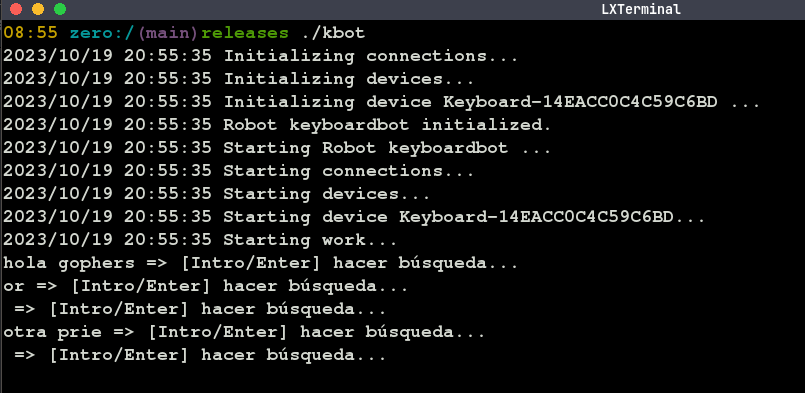

## keyboardbot

Bot de teclado para búsquedas en el navegador web predeterminado. 

Las teclas fuera del siguiente conjunto de constantes de caracteres se consideraran disparador de búsqueda. Por defecto Intro o Enter.

```go

const (
	Tilde = iota + 96
	A B C D E F G
	H I J K L M N O
	P Q R S T U V
	W X Y Z
)

const (
	Escape   = 27
	Spacebar = 32
	Hyphen   = 45
	Asterisk = 42
	Plus     = 43
	Slash    = 47
	Dot      = 46
)

const (
	Zero = iota + 48
	One
	Two
	Three
	Four
	Five
	Six
	Seven
	Eight
	Nine
)

const (
	ArrowUp = iota + 65
	ArrowDown
	ArrowRight
	ArrowLeft
)

```

### Captura



Builds para Linux y Windows en [./releases](./releases)